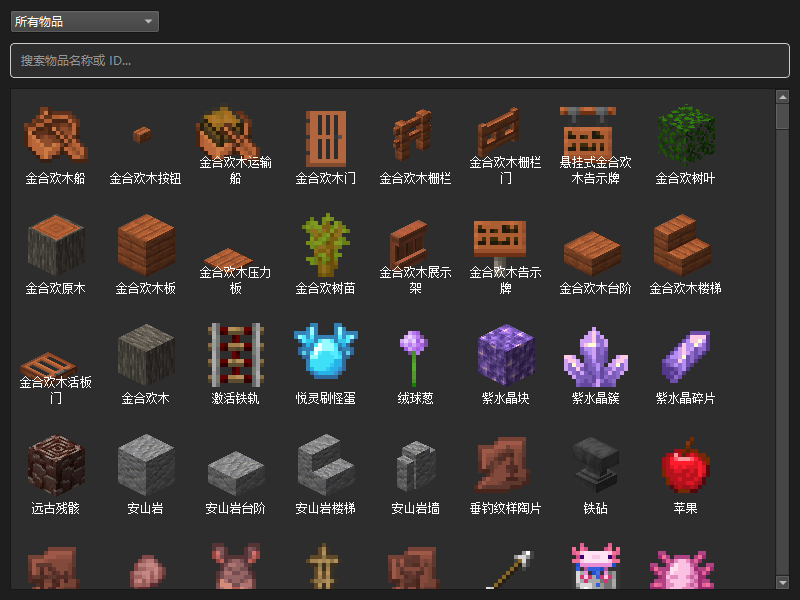
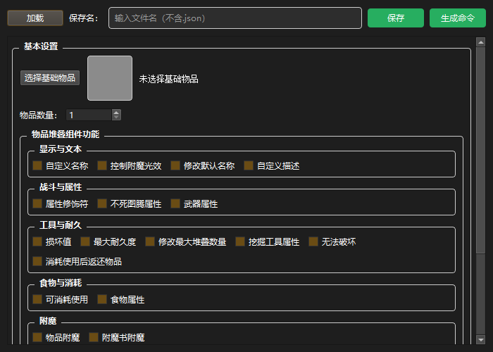
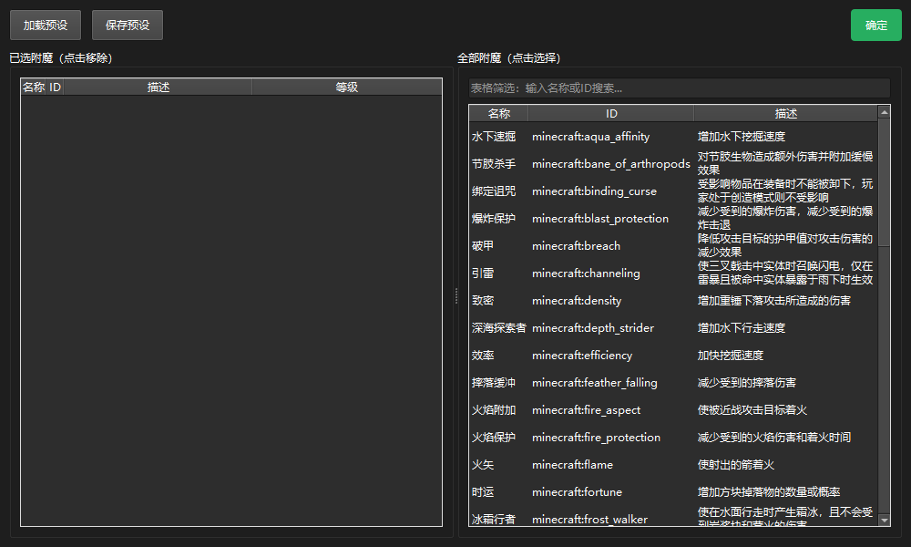
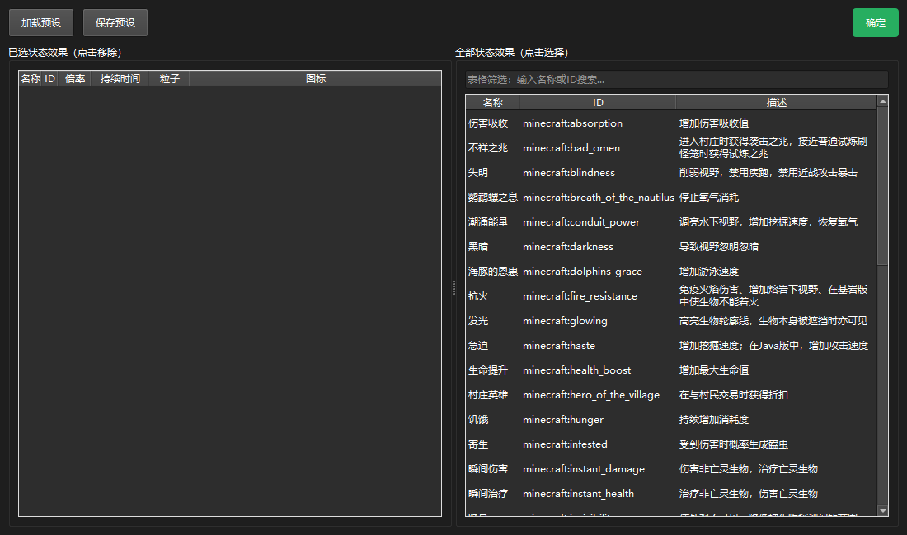
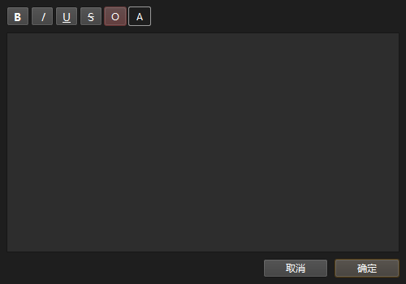

# Minecraft Custom Item Generator

**一个图形化的 Minecraft 自定义物品编辑器。** 不用查 Wiki、不用手写嵌套 JSON，在 PyQt6 界面里选物品、勾组件、挑附魔、配状态效果，一键生成 `/give` 命令并复制到剪贴板；支持 `1.20.5`–`1.21.1` 多版本切换与预设保存。

<p align="center">
  
  
  
</p>
<p align="center">
  
  
</p>

> 截图由脚本直接从运行中的应用抓取（非示意图）。

## 这是什么

自 Minecraft 1.21 起，物品的自定义能力由**物品堆叠组件（item components）**驱动，但原版流程是：对着 Wiki 反复查字段名，手写一串不直观的嵌套数据，再拼成一条 `/give` 命令。这个工具把这一整套变成界面操作：

- 从 **1505 个游戏物品**里点选基础物品（图标、中文名、创造模式分类齐全，异步加载不卡界面）
- 按版本勾选数据组件并填写参数，生成命令前实时预览
- 附魔、状态效果各自有独立选择器，可存/取预设组
- 文本组件有专门编辑器（支持颜色、点击/悬停事件等 JSON 文本语法）

## 功能

| 模块 | 说明 |
|---|---|
| **物品选择器** | 1505 个物品/方块，13 个创造模式分类 + 搜索 + 异步图标加载（子线程读 PNG，缺失纹理自动降级为彩色字母占位） |
| **物品编辑器** | 三栏可滚动布局，组件分区勾选与参数填写；支持加载已有 JSON 继续编辑 |
| **附魔选择器** | 43 个附魔，等级可调，左右双表（全部 / 已选），支持附魔组预设 |
| **状态效果选择器** | 40 个状态效果，倍率/持续时间/粒子/图标可配，支持效果组预设 |
| **JSON 文本编辑器** | 颜色、粗体/斜体等样式，点击与悬停事件的 JSON 文本组件 |
| **版本切换** | 目标版本下拉框（`1.20.5` / `1.20.6` / `1.21` / `1.21.1`），切换后组件列表按该版本的组件表重建 |
| **命令生成** | 生成 `/give` 命令，超过 256 字符时提示改用命令方块/服务器控制台；一键复制 |
| **预设** | 自定义物品、附魔组、状态效果组都可保存为 JSON 预设复用 |

## 运行

需要 Python 3.10+（开发环境使用 3.14）。

```bash
pip install -r requirements.txt      # PyQt6, pyperclip
python main.py
```

也可以打包（已附 `main.spec`）：

```bash
pyinstaller main.spec
```

## 代码结构

```
main.py                 入口：日志（含轮转）、资源自检、创建预设目录
item_editor.py          主编辑器窗口（分栏布局 + 组件区 + 命令生成） 670 行
item_selector.py        物品选择器（分类/搜索/异步图标线程） 541 行
enchantment_selector.py 附魔选择器 550 行
effect_selector.py      状态效果选择器 603 行
text_editor.py          JSON 文本编辑器 1005 行
component.py            组件系统：组件类、字段类型、版本映射表加载 1112 行
data_path.py            嵌套数据路径读写（DataPath：按路径读/写/删除/子路径） 272 行
item.py / effect.py / enchantment.py / text.py / utils.py
tools/convert_items.py  从纹理目录批量生成物品数据
data/                   物品/附魔/效果/组件表/纹理/版本映射（1.20.5 与 1.21 组件表）
```

约 6200 行 Python。

### 版本映射表与数据组织

多版本支持靠「版本映射表 + 数据组件映射表」两层：

```
data/
├── versions/versions.json        # 版本 → 组件表文件（1.20.5/1.20.6 复用 1.20.5.json，1.21/1.21.1 复用 1.21.json）
├── component_tables/             # 数据组件映射表：字段名、类型、默认值、所属槽位
│   ├── 1.20.5.json
│   └── 1.21.json
└── components/<组件ID>/<版本>.json  # 每个组件在各版本下的具体定义
```

编辑器读取所选版本的映射表来重建组件列表，因此新旧版本格式差异（字段改名、组件增删）不用改代码。

## 数据格式与内部设计

物品/附魔/效果的 JSON 结构、组件字段类型（`enum` / `list` / 特殊选择器）、`DataPath` 的路径寻址规则，以及后续可扩展的类型，整理在 [docs/数据格式参考.md](docs/数据格式参考.md)。

## 已知限制

- 物品列表依赖纹理文件识别，新增物品需重跑 `tools/convert_items.py`（见下）
- 只支持 `1.20.5` 及以上版本的组件格式；`1.20.4` 及更早的 NBT 写法未实现
- 命令长度上限按命令方块限制（256 字符）提示，不自动拆分
- 界面为中文

## 更新物品列表

1. 用游戏内 Mod（如 [WikiRenderer](https://www.mcmod.cn/class/25544.html)）批量导出物品渲染图到 `data/textures/`（分辨率 128、文件名预设 `%id%`）
2. 运行转换脚本：

```bash
py tools/convert_items.py
```

脚本扫描纹理文件名作为物品 ID，从 `raw_game_data/zh_cn.json` 取中文名，并按 `tools/item_categories.py` 的分类规则自动归类。

## 许可

本项目未附带开源许可证文件；如需复用请先联系作者。
