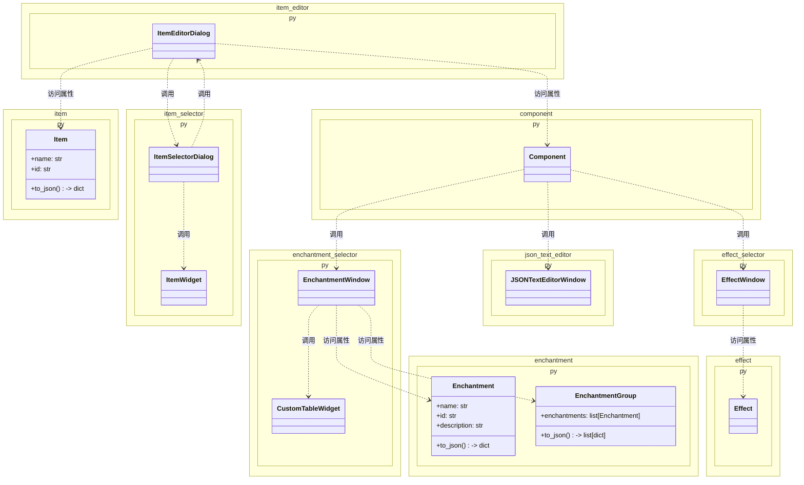

# Minecraft物品编辑器

## 总体设计

### 项目简介

本程序旨在实现一个图形化、易于操作的Minecraft物品编辑器。自 `1.21` 版本以来，Minecraft通过物品堆叠组件极大的增强了物品的自定义能力。然而，原版中想要创建一个具有特定属性的物品需要反复查Wiki、并编写一系列不直观的嵌套数据格式和命令。本程序目标是让新人玩家无需学习复杂数据结构，就能轻松编辑出自己想要的物品。而资深玩家、地图制作者、整合包开发者等用户，也能通过本工具快速生成复杂物品，提升工作效率。

### 功能规划

#### 1. 物品数据结构与编辑

- [x] 物品数据结构
- [x] 物品选择窗口
- [x] 自定义物品编辑器窗口
- [x] 支持更多的物品堆叠组件

#### 2. 附魔数据结构与编辑

- [x] 附魔和附魔组数据结构
- [x] 附魔选择器窗口

#### 3. 状态效果数据结构与编辑

- [x] 状态效果和状态效果组数据结构
- [x] 状态效果选择器窗口

#### 4. JSON文本编辑器

- [ ] JSON文本编辑器窗口

## 文件结构

（未来将实现的）依赖关系图：



## Component组件类详解

### JSON格式

本程序使用JSON格式来描述各个物品堆叠组件的功能及其字段。组件类的JSON格式遵循如下结构：

```json
{
    "id": "组件ID",
    "description": "组件描述",
    "components": {
        ...
    }
}
```

其中，`id`字段是组件的唯一标识符，通常与Minecraft中的组件名称相同；`description`字段是对该组件功能的简要描述；`components`字段是一个对象，包含了该字段的类型、默认值、描述等信息。

在最简单的示例中，`components`字段是一个空对象，表示该组件没有任何字段：

```json
{
    "id": "unbreakable",
    "description": "无法破坏",
    "components": {}
}
```

也可以采用更简洁的写法，直接省略`components`字段：

```json
{
    "id": "unbreakable",
    "description": "无法破坏"
}
```

现在来看一个稍复杂的示例：

```json
{
    "id": "food",
    "description": "食物",
    "components": {
        "type": "dict",
        "values": {
            "can_always_eat": {
                "type": "bool",
                "default": false,
                "description": "饥饿值满时可食用"
            },
            "nutrition": {
                "type": "int",
                "place_holder_text": "整数，默认0",
                "description": "饥饿值"
            },
            "saturation": {
                "type": "float",
                "place_holder_text": "浮点数，默认0.0",
                "description": "饱和度"
            }
        }
    }
}
```

在这个示例中，`food`组件有三个字段：`can_always_eat`、`nutrition`和`saturation`。每个字段都包含了它的类型和描述信息，以及可选的默认值。

请注意，因为`components`默认只能放一个字段，要放入多个字段时，需要将`components`的`type`设置为`dict`，并将所有字段放入`values`对象中。此情况下无需填写`description`。

每个字段包含的属性如下：

|属性名|类型|必填|说明|
|---|---|---|---|
|`type`|`string`|√|字段类型，可选类型详见下文|
|`description`|`string`|√|字段描述，用于生成设置界面的文字|
|`default`|由`type`决定|`type`为`bool`时必填|字段的默认值|
|`place_holder_text`|`string`||输入框的占位文本，仅对部分类型有效，详见下文|
|`values`|由`type`决定||部分字段类型所需的额外信息|

### 组件字段类型

组件字段类型包括编程语言中常见的数据类型，例如`int`、`float`、`string`、`bool`等，也包括一些由此程序自定义的类型。以下是目前所有支持的字段类型：

|类型|说明|对应窗口控件|额外属性|
|---|---|---|---|
|`int`|整数|输入框|`default`（整数）、`place_holder_text`（字符串）|
|`float`|浮点数|输入框|`default`（浮点数）、`place_holder_text`（字符串）|
|`string`|字符串|输入框|`default`（字符串）、`place_holder_text`（字符串）|
|`bool`|布尔值|复选框|`default`（布尔值）|
|`list`|对象列表|表格|`values`|
|`dict`|对象字典|由`values`决定的控件|`values`|
|`simple_enum`|简单枚举类型|下拉框|`values`|
|`enum`|复杂枚举类型|下拉框及由`values`决定的其他控件|`values`|
|`text_component`|单行 JSON 文本组件|富文本编辑器（支持 B/I/U/S/O 和 16 种预设颜色）||
|`text_component_multiline`|多行 JSON 文本组件列表|多行富文本编辑器（每行一个组件）|用于 `lore` 等多行场景|
|`item`|物品|物品选择器||
|`enchantment`|附魔|附魔组选择器||
|`sound_event`|声音事件|声音选择器||
|`effect`|状态效果|效果选择器||

> **提示**：`enum`、`list` 等复杂类型以及 `item`、`enchantment`、`effect` 等特殊选择器类型的详细格式说明，请参见下方「[数据格式规范](#组件高级类型详解)」章节。

## 数据格式规范

本章节详细说明程序中各类 JSON 数据文件的格式规范，包括物品、附魔、状态效果及其组合数据结构。

### 物品 (Item)

物品数据存储在 `data/items/` 目录下的 JSON 文件中。每个文件是一个物品对象，包含以下字段：

|字段名|类型|必填|说明|
|---|---|---|---|
|`name`|`string`|√|物品名称，用于界面显示|
|`id`|`string`|√|物品 ID，Minecraft 内部标识（如 `minecraft:diamond_sword`）|
|`categories`|`string[]`|√|物品分类标签列表，详见[物品类别](#物品类别)|
|`components`|`object`||物品堆叠组件，键为组件 ID，值为组件数据。默认为空对象 `{}`|
|`count`|`int`||物品数量，默认为 `1`|

**示例**（`data/items/diamond_sword.json`）：

```json
{
    "name": "钻石剑",
    "id": "minecraft:diamond_sword",
    "categories": ["combat"]
}
```

**示例**（`data/items/apple.json`）：

```json
{
    "name": "苹果",
    "id": "minecraft:apple",
    "categories": ["food"]
}
```

### 自定义物品

用户在物品编辑器中创建的自定义物品保存在 `custom/items/` 目录中。文件名（不含 `.json` 扩展名）即为物品名称。

自定义物品的 JSON 格式与基础物品相同，但有以下区别：

- `categories` 固定为 `["custom"]`
- 文件名被视为物品的 `name`
- 通常会包含 `components` 字段来存储用户编辑的组件数据

**示例**（`custom/items/我的自定义剑.json`）：

```json
{
    "name": "我的自定义剑",
    "id": "minecraft:diamond_sword",
    "categories": ["custom"],
    "components": {
        "enchantments": {
            "minecraft:sharpness": 5
        },
        "custom_name": "§6传奇之剑"
    },
    "count": 1
}
```

### 物品类别

物品的 `categories` 字段使用以下类别标签进行分类：

|标签|说明|
|---|---|
|`custom`|自定义物品|
|`building`|建筑方块|
|`dyed`|染色方块|
|`natural`|自然方块|
|`functional`|功能方块|
|`redstone`|红石方块|
|`tool`|工具与实用物品|
|`combat`|战斗用品|
|`food`|食物与饮品|
|`material`|原材料|
|`spawn_egg`|刷怪蛋|
|`admin`|管理员用品|

### 附魔 (Enchantment)

附魔数据存储在 `data/enchantments/` 目录下的 JSON 文件中。每个文件对应一个附魔，包含以下字段：

|字段名|类型|必填|说明|
|---|---|---|---|
|`name`|`string`|√|附魔名称，用于界面显示|
|`id`|`string`|√|附魔 ID（如 `minecraft:sharpness`）|
|`max_level`|`int`||最大等级。无此字段表示无等级上限（如 `infinity`）|
|`description`|`string`||附魔描述文本|

**示例**（`data/enchantments/sharpness.json`）：

```json
{
    "name": "锋利",
    "id": "minecraft:sharpness",
    "max_level": 5,
    "description": "增加近战攻击伤害"
}
```

**示例**（`data/enchantments/fortune.json`）：

```json
{
    "name": "时运",
    "id": "minecraft:fortune",
    "max_level": 3,
    "description": "增加方块掉落物的数量或概率"
}
```

### 附魔组 (EnchantmentGroup)

附魔组是多个附魔及其等级的组合，以 JSON 数组形式存储。在附魔数据的基础上，每个附魔多一个 `level` 字段：

|额外字段|类型|说明|
|---|---|---|
|`level`|`int`|附魔等级，取值范围 `1` ~ `max_level`。默认为 `1`|

**预设保存格式**（`custom/enchantments/*.json`）：

保存为附魔对象数组，每个附魔包含完整的名称、ID、描述、等级等信息：

```json
[
    {
        "name": "时运",
        "id": "minecraft:fortune",
        "max_level": 3,
        "description": "增加方块掉落物的数量或概率",
        "level": 3
    },
    {
        "name": "效率",
        "id": "minecraft:efficiency",
        "max_level": 5,
        "description": "加快破坏方块的速度",
        "level": 5
    }
]
```

> **注意**：附魔组作为物品堆叠组件（如 `enchantments`、`stored_enchantments`）的最终输出值时，格式为 `{"<附魔ID>": <等级>, ...}` 的字典，而非数组。这是因为 Minecraft 命令中的附魔数据采用键值对格式。例如：`{"minecraft:sharpness": 5, "minecraft:unbreaking": 3}`。

### 状态效果 (Effect)

状态效果数据存储在 `data/effects/` 目录下的 JSON 文件中。每个文件对应一个状态效果，包含以下字段：

|字段名|类型|必填|说明|
|---|---|---|---|
|`name`|`string`|√|效果名称，用于界面显示|
|`id`|`string`|√|效果 ID（如 `minecraft:speed`）|
|`description`|`string`||效果描述文本|
|`amplifier`|`int`||效果倍率。默认为 `0`。Minecraft 中**等级 = 倍率 + 1**，如力量 II 的倍率为 `1`|
|`duration`|`int`||持续时间（单位：刻）。`0` 代表 1 刻，`-1` 代表无限时间。默认为 `0`|
|`show_particles`|`bool`||是否显示效果粒子。默认为 `true`|
|`show_icon`|`bool`||是否在状态栏显示效果图标。默认为 `null`（跟随 `show_particles`）|

**示例**（`data/effects/speed.json`）：

```json
{
    "name": "迅捷",
    "id": "minecraft:speed",
    "description": "增加移动速度"
}
```

**示例**（`data/effects/strength.json`）：

```json
{
    "name": "力量",
    "id": "minecraft:strength",
    "description": "增加近战攻击伤害"
}
```

### 状态效果组 (EffectGroup)

状态效果组是多个状态效果及其参数组合，以 JSON 数组形式存储。在状态效果数据的基础上，每个效果可额外指定以下运行时参数：

|额外字段|类型|说明|
|---|---|---|
|`amplifier`|`int`|效果倍率（等级 = 倍率 + 1）|
|`duration`|`int`|持续时间（刻），`-1` 为无限|
|`show_particles`|`bool`|是否显示粒子|
|`show_icon`|`bool`|是否显示图标|

**预设保存格式**（`custom/effects/*.json`）：

```json
[
    {
        "name": "夜视",
        "id": "minecraft:night_vision",
        "description": "调亮视野",
        "amplifier": 0
    },
    {
        "name": "力量",
        "id": "minecraft:strength",
        "description": "增加近战攻击伤害",
        "amplifier": 1
    }
]
```

> **说明**：`to_dict()` 方法在序列化时会省略取默认值的字段（`amplifier=0`、`duration=0` 等），以保持输出简洁。
>
> **注意**：状态效果组作为物品堆叠组件（如 `consumable` 的 `on_consume_effects`、`death_protection` 的 `death_effects`）的输出值时，格式取决于组件定义：
>
> - 作为 `apply_effects` 子类型时，输出 `{"effects": [...效果对象数组...], "probability": 1.0}`
> - 直接作为效果选择器时，输出效果对象数组 `[{...}, {...}]`

### 组件高级类型详解

以下对[组件字段类型](#组件字段类型)中较为复杂的类型进行详细说明。

#### `enum`（复杂枚举类型）

`enum` 类型与 `simple_enum` 类似，都以下拉框选择为基础。区别在于 `enum` 的每个选项可以携带额外的子字段——选中不同选项时，界面会动态显示不同的子编辑控件。

**格式**：

```json
{
    "type": "enum",
    "description": "字段描述",
    "values": {
        "<选项显示名>": {
            "id": "<选项实际值>",
            "components": { ... }   // 可选，选中此选项后展示的子字段
        },
        ...
    }
}
```

每个选项的 `id` 会被写入到数据的 `type` 键中。若选项包含 `components`，则选中该选项后会加载对应的子编辑控件。

**示例**（取自 `consumable.json` 中 `on_consume_effects` 的简化片段）：

```json
{
    "type": "enum",
    "description": "效果类型",
    "values": {
        "给予状态效果": {
            "id": "apply_effects",
            "components": {
                "type": "dict",
                "values": {
                    "effects": {
                        "type": "effect",
                        "description": "要施加的状态效果"
                    },
                    "probability": {
                        "type": "float",
                        "description": "效果生效概率（0.0~1.0）",
                        "place_holder_text": "默认1.0（100%）"
                    }
                }
            }
        },
        "移除所有状态效果": {
            "id": "clear_all_effects"
        },
        "播放声音": {
            "id": "play_sound",
            "components": { ... }
        }
    }
}
```

对应的输出 JSON 格式为：

```json
{
    "type": "apply_effects",
    "effects": [...],
    "probability": 1.0
}
```

#### `list`（列表类型）

`list` 类型表示一个可动态增删的对象列表。列表中的每个元素可以是标量值或字典对象，取决于 `values` 中指定的子类型。

**格式**：

```json
{
    "type": "list",
    "description": "列表描述",
    "values": {
        "type": "<元素类型>",
        ...                  // 元素类型的其他属性
    }
}
```

**标量列表** — 当 `values.type` 为 `int`、`float`、`string`、`text_component`、`bool` 或 `simple_enum` 时，列表直接存储值：

示例（取自 `attribute_modifiers.json` 的简化片段）：

**多行文本类型** — `text_component_multiline` 直接表示一个文本组件列表，每行一个组件，
不再需要嵌套 `list` + `text_component`。示例（`lore.json`）：

```json
{
    "id": "lore",
    "description": "自定义描述",
    "components": {
        "type": "text_component_multiline",
        "description": "多行描述文本"
    }
}
```

对应输出 JSON：

```json
[
    {"text": "", "extra": [{"text": "第一行", "bold": true}]},
    {"text": "第二行"}
]
```

**字典列表** — 当 `values.type` 为 `dict` 或 `enum` 时，列表存储对象：

示例（取自 `attribute_modifiers.json` 的简化片段）：

```json
{
    "type": "list",
    "description": "属性修饰符列表",
    "values": {
        "type": "dict",
        "values": {
            "type": { "type": "simple_enum", ... },
            "amount": { "type": "float", ... },
            "slot": { "type": "simple_enum", ... }
        }
    }
}
```

对应输出 JSON：

```json
[
    {
        "type": "attack_damage",
        "amount": 5.0,
        "slot": "mainhand",
        "operation": "add_value",
        "id": "base_attack_damage"
    }
]
```

#### 特殊选择器类型

以下类型在编辑时会打开专用的选择器窗口，产生的值有其固定格式：

|类型|选择器窗口|输出 JSON 格式|
|---|---|---|
|`item`|物品选择器|`{"id": "<物品ID>", "count": <数量>, "components": {...}}` 或纯字符串 `"<物品ID>"`|
|`enchantment`|附魔组选择器|`{"<附魔ID>": <等级>, ...}`（键值对字典）|
|`effect`|状态效果选择器|效果对象数组 `[{...}, {...}]` 或 `{"effects": [...], "probability": ...}`|

> **示例**：`use_remainder` 组件（`item` 类型）的输出值：
>
> ```json
> {"id": "minecraft:glass_bottle", "count": 1}
> ```
>
> **示例**：`enchantments` 组件（`enchantment` 类型）的输出值：
>
> ```json
> {"minecraft:sharpness": 5, "minecraft:unbreaking": 3}
> ```

### 待实现类型

以下组件字段类型已在类型表中列出，但相关编辑器窗口尚未完全实现，目前暂时作为普通字符串输入框处理：

|类型|当前行为|计划|
|---|---|---|
|`block_filter`|普通文本输入框|需要方块 ID / 标签选择器|
|`sound_event`|（暂无组件使用）|需要声音事件选择器|

## 提示词

### 物品选择窗口

使用PyQt6实现这样的一个窗口：顶部左侧有一下拉选择框选择“所有物品、自定义物品、建筑方块、染色方块、自然方块、功能方块、红石方块、工具与实用物品、战斗用品、食物与饮品、原材料、刷怪蛋、管理员用品”，顶部右侧为一按钮“创建新自定义物品”，中间是一搜索框，底下是一个网格状显示区域，显示每个物品的图标及其名字，整体类似Windows的以图标显示模式的资源管理器（如图）。搜索框可以根据输入的文本过滤显示的物品，只有当物品名称或ID包含输入文本时才会显示该物品。有滚动条，会根据窗口宽度自动改变每行显示的数量。窗口整体能根据系统切换深色/浅色模式以满足不同需要。当鼠标指针悬停于一物品图标上时，显示该物品的ID。

物品信息由前面代码中的`Item`类实现。对于一个`Item`实例，可读取其`name`属性获取物品名称，读取其`icon`属性获取物品图标（一个png图片路径），读取其`id`属性获取物品ID。`tags`属性（`list[str]`类型）中包含了该物品的分类标签。根据这些标签，物品会被分类显示在不同的类别中。所有分类标签如下：

- `custom`：自定义物品
- `building`：建筑方块
- `dyed`：染色方块
- `natural`：自然方块
- `functional`：功能方块
- `redstone`：红石方块
- `tool`：工具与实用物品
- `combat`：战斗用品
- `food`：食物与饮品
- `material`：原材料
- `spawn_egg`：刷怪蛋
- `admin`：管理员用品

“所有物品”窗口中始终显示所有物品。其他分类窗口中只显示具有对应标签的物品。

实现该窗口后，编写一个便捷函数`choose_item()`。该函数会打开上述物品选择窗口。当点击一个物品图标后，窗口关闭并让函数返回该物品（一个`Item`实例）。

### 自定义物品窗口

仿照该Qt窗口风格，实现一个“自定义物品编辑器”窗口。该窗口允许用户创建自定义物品。程序中有多个分区：

最顶部有“保存名：[输入框]”和“保存”按钮，点击保存后会将当前编辑的自定义物品以“保存名.json”格式保存到“data/items”文件夹中。保存的JSON文件包含该自定义物品的所有信息（ID、名称、图标路径、物品堆叠组件等）。JSON数据可以由Item实例的`to_json()`方法轻松生成。

- 基本信息：本分区有一个“选择基础物品”按钮，通过调用`choose_item(only_basic=True)`函数让用户选择一个基本物品作为模板。选择后会显示该物品的图标。之后有“物品数量：[输入框]”和“耐久（损害值）：[输入框]”让用户手动输入物品的数量和耐久。之后有“修改物品名”“修改物品描述”按钮，点击后会调用尚未实现的`json_text_editor()`函数让用户编辑物品的名称和描述（显示在物品悬停提示中的文本）。

暂时就实现基本信息分区，其他分区后面我自行添加。

### 附魔选择器

使用Qt6实现一个类似图中的窗口。顶部为一输入框，提示输入附魔组名，和一绿色保存按钮，样式表为

```css
QPushButton {
    padding: 6px 16px;
    border-radius: 4px;
    background-color: #27ae60;
    color: white;
    border: none;
}
QPushButton:hover {
    background-color: #2ecc71;
}
QPushButton:pressed {
    background-color: #219653;
}
```

下方分左右两栏，左边为“已选附魔”，右边为“未选附魔”，“未选附魔”内有一搜索框，可按名字或ID搜索附魔。未选附魔内有三列表格，分别为“名称”“ID”“描述”，已选附魔内有四列表格，分别为“名称”“ID”“描述”“等级”。“等级”为输入框，其中提示默认等级和最高等级。
当用户鼠标停留在某“未选附魔”上时，悬浮信息提示“点击选择”，停留在某“已选附魔”上时，悬浮信息提示“点击移除”。并实现点击选择后选择的附魔出现在“已选附魔”中，同时从“未选附魔”中消失。移除功能同理。

### 优化物品编辑器窗口，增加分栏

现在随着功能增多，这个窗口正变得越来越长。请从以下几个方面让整个界面能在屏幕里放得下：

1. 当窗口高度不足以容纳所有项目时，加入滚动条
2. 按窗口宽度自动分栏显示各项目（宽度不足时1栏、宽度较大时2栏甚至3栏）
3. 适当调低所有QLineEdit的默认宽度，现在的太宽了

### 优化附魔选择器窗口，增加预设功能

现在此代码中的窗口顶部有一个输入框和一个“保存”按钮。我希望对顶部作如下改动：

1. 取消输入框，右侧“保存”按钮改为“确定”按钮。
2. 左边新增两个默认样式按钮，分别为“加载预设”和“保存预设”，点击“保存预设”会弹出输入框让用户输入保存名，确认后会干原来的保存按钮干的事。点击“加载预设”则会弹出一个窗口让用户选择所需的附魔组JSON文件。
3. 新的“确定”按钮按下之后，会返回一个#sym:EnchantmentGroup 对象，内容即为用户在窗口中编辑的自定义附魔。
