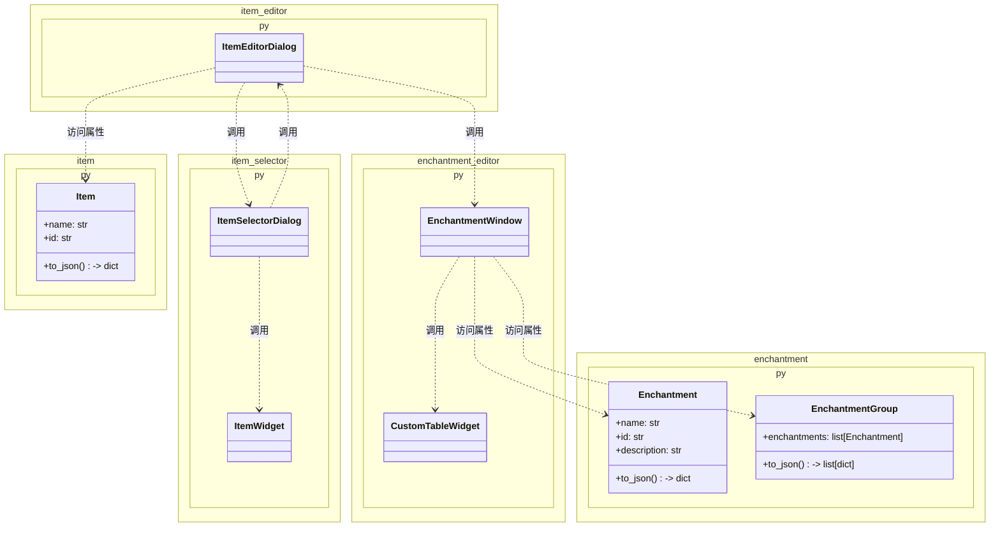

# Minecraft物品编辑器

## 总体设计

### 项目简介

本程序旨在实现一个图形化、易于操作的Minecraft物品编辑器。自 `1.21` 版本以来，Minecraft通过物品堆叠组件极大的增强了物品的自定义能力。然而，原版中想要创建一个具有特定属性的物品需要反复查Wiki、并编写一系列不直观的嵌套数据格式和命令。本程序目标是让新人玩家无需学习复杂数据结构，就能轻松编辑出自己想要的物品。而资深玩家、地图制作者、整合包开发者等用户，也能通过本工具快速生成复杂物品，提升工作效率。

### 功能规划

#### 1. 物品数据结构与编辑

- [x] 物品数据结构
- [x] 物品选择窗口
- [x] 自定义物品编辑器窗口
- [ ] 支持更多的物品堆叠组件

#### 2. 附魔数据结构与编辑

- [x] 附魔和附魔组数据结构
- [x] 附魔选择器窗口

#### 3. 状态效果数据结构与编辑

- [ ] 状态效果和状态效果组数据结构
- [ ] 状态效果选择器窗口

#### 4. JSON文本编辑器

- [ ] JSON文本编辑器窗口

## 文件结构

依赖关系图：



## Component组件类详解

### JSON格式

本程序使用JSON格式来描述各个物品堆叠组件的功能及其字段。组件类的JSON格式遵循如下结构：

```json
{
    "id": "组件ID",
    "description": "组件描述",
    "components": {
        ...
    }
}
```

其中，`id`字段是组件的唯一标识符，通常与Minecraft中的组件名称相同；`description`字段是对该组件功能的简要描述；`components`字段是一个对象，包含了该字段的类型、默认值、描述等信息。

在最简单的示例中，`components`字段是一个空对象，表示该组件没有任何字段：

```json
{
    "id": "unbreakable",
    "description": "无法破坏",
    "components": {}
}
```

也可以采用更简洁的写法，直接省略`components`字段：

```json
{
    "id": "unbreakable",
    "description": "无法破坏"
}
```

现在来看一个稍复杂的示例：

```json
{
    "id": "food",
    "description": "食物",
    "components": {
        "type": "dict",
        "values": {
            "can_always_eat": {
                "type": "bool",
                "default": false,
                "description": "饥饿值满时可食用"
            },
            "nutrition": {
                "type": "int",
                "place_holder_text": "整数，默认0",
                "description": "饥饿值"
            },
            "saturation": {
                "type": "float",
                "place_holder_text": "浮点数，默认0.0",
                "description": "饱和度"
            }
        }
    }
}
```

在这个示例中，`food`组件有三个字段：`can_always_eat`、`nutrition`和`saturation`。每个字段都包含了它的类型和描述信息，以及可选的默认值。

请注意，因为`components`默认只能放一个字段，要放入多个字段时，需要将`components`的`type`设置为`dict`，并将所有字段放入`values`对象中。此情况下无需填写`description`。

每个字段包含的属性如下：

|属性名|类型|必填|说明|
|---|---|---|---|
|`type`|`string`|√|字段类型，可选类型详见下文|
|`description`|`string`|√|字段描述，用于生成设置界面的文字|
|`default`|由`type`决定|`type`为`bool`时必填|字段的默认值|
|`place_holder_text`|`string`||输入框的占位文本，仅对部分类型有效，详见下文|
|`values`|由`type`决定||部分字段类型所需的额外信息|

### 组件字段类型

组件字段类型包括编程语言中常见的数据类型，例如`int`、`float`、`string`、`bool`等，也包括一些由此程序自定义的类型。以下是目前所有支持的字段类型：

|类型|说明|对应窗口控件|额外属性|
|---|---|---|---|
|`int`|整数|输入框|`default`（整数）、`place_holder_text`（字符串）|
|`float`|浮点数|输入框|`default`（浮点数）、`place_holder_text`（字符串）|
|`string`|字符串|输入框|`default`（字符串）、`place_holder_text`（字符串）|
|`bool`|布尔值|复选框|`default`（布尔值）|
|`list`|对象列表|表格|`values`|
|`dict`|对象字典|由`values`决定的控件|`values`|
|`simple_enum`|简单枚举类型|下拉框|`values`|
|`enum`|复杂枚举类型|下拉框及由`values`决定的其他控件|`values`|
|`item`|物品|物品选择器||
|`enchantment`|附魔|附魔组选择器||
|`sound_event`|声音事件|声音选择器||
|`json_text`|JSON文本|JSON文本编辑器||

## 提示词

### 物品选择窗口

使用PyQt6实现这样的一个窗口：顶部左侧有一下拉选择框选择“所有物品、自定义物品、建筑方块、染色方块、自然方块、功能方块、红石方块、工具与实用物品、战斗用品、食物与饮品、原材料、刷怪蛋、管理员用品”，顶部右侧为一按钮“创建新自定义物品”，中间是一搜索框，底下是一个网格状显示区域，显示每个物品的图标及其名字，整体类似Windows的以图标显示模式的资源管理器（如图）。搜索框可以根据输入的文本过滤显示的物品，只有当物品名称或ID包含输入文本时才会显示该物品。有滚动条，会根据窗口宽度自动改变每行显示的数量。窗口整体能根据系统切换深色/浅色模式以满足不同需要。当鼠标指针悬停于一物品图标上时，显示该物品的ID。

物品信息由前面代码中的`Item`类实现。对于一个`Item`实例，可读取其`name`属性获取物品名称，读取其`icon`属性获取物品图标（一个png图片路径），读取其`id`属性获取物品ID。`tags`属性（`list[str]`类型）中包含了该物品的分类标签。根据这些标签，物品会被分类显示在不同的类别中。所有分类标签如下：

- `custom`：自定义物品
- `building`：建筑方块
- `dyed`：染色方块
- `natural`：自然方块
- `functional`：功能方块
- `redstone`：红石方块
- `tool`：工具与实用物品
- `combat`：战斗用品
- `food`：食物与饮品
- `material`：原材料
- `spawn_egg`：刷怪蛋
- `admin`：管理员用品

“所有物品”窗口中始终显示所有物品。其他分类窗口中只显示具有对应标签的物品。

实现该窗口后，编写一个便捷函数`choose_item()`。该函数会打开上述物品选择窗口。当点击一个物品图标后，窗口关闭并让函数返回该物品（一个`Item`实例）。

### 自定义物品窗口

仿照该Qt窗口风格，实现一个“自定义物品编辑器”窗口。该窗口允许用户创建自定义物品。程序中有多个分区：

最顶部有“保存名：[输入框]”和“保存”按钮，点击保存后会将当前编辑的自定义物品以“保存名.json”格式保存到“data/items”文件夹中。保存的JSON文件包含该自定义物品的所有信息（ID、名称、图标路径、物品堆叠组件等）。JSON数据可以由Item实例的`to_json()`方法轻松生成。

- 基本信息：本分区有一个“选择基础物品”按钮，通过调用`choose_item(only_basic=True)`函数让用户选择一个基本物品作为模板。选择后会显示该物品的图标。之后有“物品数量：[输入框]”和“耐久（损害值）：[输入框]”让用户手动输入物品的数量和耐久。之后有“修改物品名”“修改物品描述”按钮，点击后会调用尚未实现的`json_text_editor()`函数让用户编辑物品的名称和描述（显示在物品悬停提示中的文本）。

暂时就实现基本信息分区，其他分区后面我自行添加。

### 附魔选择器

使用Qt6实现一个类似图中的窗口。顶部为一输入框，提示输入附魔组名，和一绿色保存按钮，样式表为

```css
QPushButton {
    padding: 6px 16px;
    border-radius: 4px;
    background-color: #27ae60;
    color: white;
    border: none;
}
QPushButton:hover {
    background-color: #2ecc71;
}
QPushButton:pressed {
    background-color: #219653;
}
```

下方分左右两栏，左边为“已选附魔”，右边为“未选附魔”，“未选附魔”内有一搜索框，可按名字或ID搜索附魔。未选附魔内有三列表格，分别为“名称”“ID”“描述”，已选附魔内有四列表格，分别为“名称”“ID”“描述”“等级”。“等级”为输入框，其中提示默认等级和最高等级。
当用户鼠标停留在某“未选附魔”上时，悬浮信息提示“点击选择”，停留在某“已选附魔”上时，悬浮信息提示“点击移除”。并实现点击选择后选择的附魔出现在“已选附魔”中，同时从“未选附魔”中消失。移除功能同理。

### 优化物品编辑器窗口，增加分栏

现在随着功能增多，这个窗口正变得越来越长。请从以下几个方面让整个界面能在屏幕里放得下：

1. 当窗口高度不足以容纳所有项目时，加入滚动条
2. 按窗口宽度自动分栏显示各项目（宽度不足时1栏、宽度较大时2栏甚至3栏）
3. 适当调低所有QLineEdit的默认宽度，现在的太宽了
