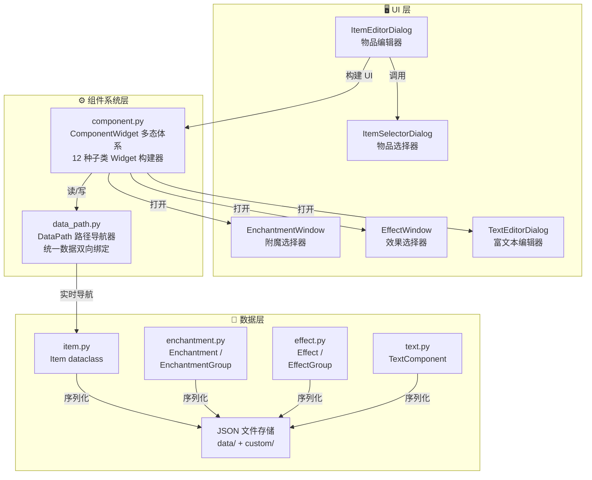
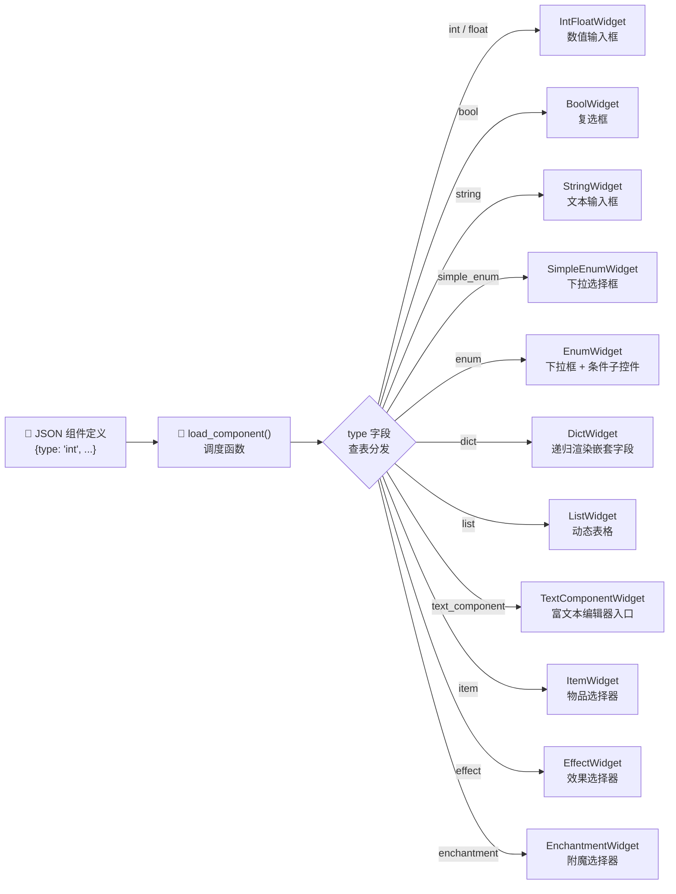
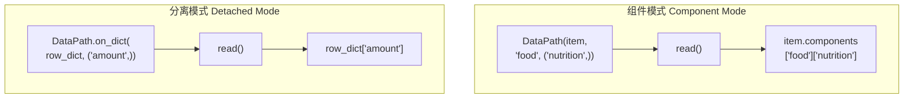
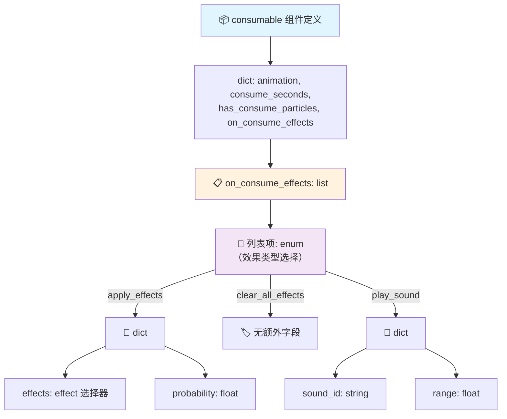
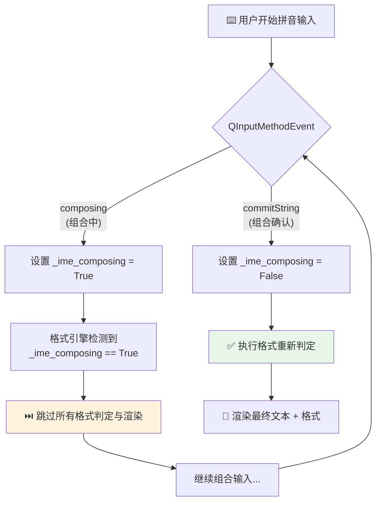
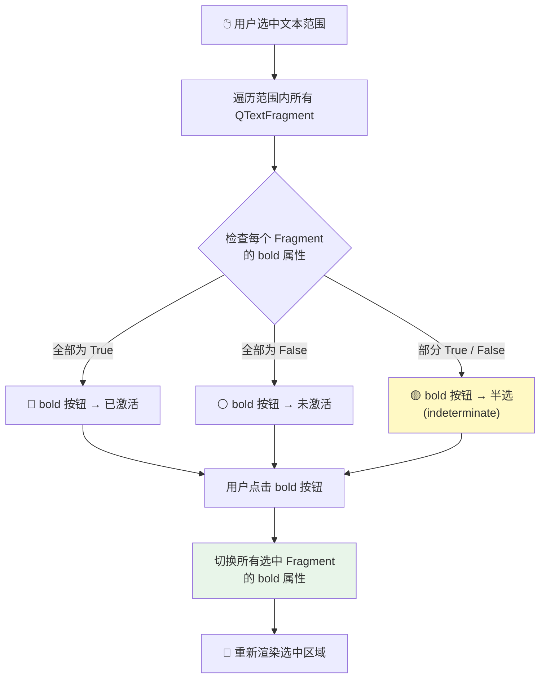
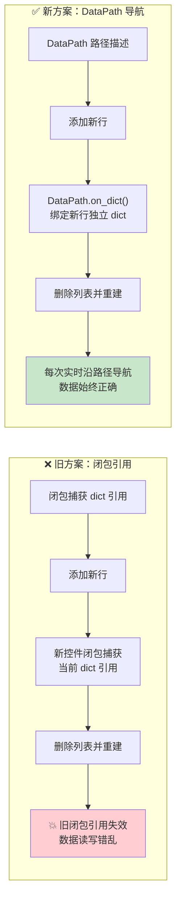

# Minecraft 物品编辑器 —— 项目报告

## 摘要

Minecraft 自 1.21 版本引入物品堆叠组件（Item Stack Components）系统后，物品的自定义能力得到极大增强。然而，原版中创建自定义物品需要反复查阅 Wiki 并手动编写复杂的嵌套数据格式与命令，对普通玩家极不友好。本文介绍了一款基于 PyQt6 的图形化 Minecraft 物品编辑器，采用数据驱动的 JSON 组件定义架构，将 16 种物品堆叠组件、40 余种属性修饰符、30 余种状态效果与附魔整合为直观的 GUI 操作界面，并内置富文本编辑器与命令生成功能。该项目完全以 Python 实现，显著降低了 Minecraft 自定义物品的创作门槛。

**关键词**：Minecraft；物品堆叠组件；PyQt6；GUI 工具；数据驱动

---

## 1 动机

### 1.1 背景

Minecraft Java 版 1.21 更新中，Mojang 用全新的物品堆叠组件系统替代了原有的 NBT 标签体系。组件系统采用结构化、模块化的方式描述物品属性——武器伤害、食物营养值、属性修饰符、附魔、状态效果施加等均被抽象为独立的"组件"，玩家可自由组合以创造功能各异的自定义物品。

### 1.2 痛点分析

尽管组件系统设计优雅，原版创建自定义物品的流程却极其繁琐：

1. **知识门槛高**：用户需熟悉每个组件的 JSON 结构、字段名称、合法取值范围，反复查阅 Minecraft Wiki 是常态；
2. **格式易出错**：组件嵌套层级深（如 `consumable → on_consume_effects → apply_effects → effects` 可达四层），手动编写极易出现语法错误或字段拼写错误；
3. **缺乏即时反馈**：在原版中编写 `/give` 命令时，无法直观预览物品属性，只能进入游戏验证，迭代效率低下；
4. **文本组件复杂**：Minecraft 的 JSON 文本组件（Raw JSON Text）支持 7 种组件类型、富文本样式、点击/悬停事件，手动编写几乎不可能不出错。

### 1.3 项目目标

本项目的核心目标是**让任何玩家——无论技术水平高低——都能轻松创建自定义 Minecraft 物品**。具体而言：

- 为新手玩家提供直观的图形界面，无需学习任何 JSON 语法即可编辑物品；
- 为资深玩家、地图制作者、整合包开发者提供高效的工具，快速生成复杂物品的 `/give` 命令；
- 构建一套可扩展的数据驱动架构，使新增组件定义仅需添加一个 JSON 文件。

---

## 2 架构与功能

### 2.1 总体架构

项目采用**分层架构**设计，自上而下分为三层（见图 1）：



<p align="center"><b>图 1 &nbsp; 系统三层架构与模块依赖关系</b></p>

- **数据层**：定义核心数据结构（Item、Enchantment、Effect、TextComponent 等 dataclass），管理 JSON 文件的读写，提供 `to_dict()` 序列化与 `item_stack()` 命令生成方法；
- **组件系统层**：将 JSON 组件定义动态渲染为 PyQt6 控件，通过 DataPath 实现统一的读写绑定，是项目的核心引擎；
- **UI 层**：提供物品编辑器主窗口、物品选择器、附魔/效果选择器、富文本编辑器等交互界面。

技术栈：Python 3.14 + PyQt6 + JSON，无其他第三方运行时依赖。

### 2.2 核心模块

#### 2.2.1 数据模型（`item.py` / `enchantment.py` / `effect.py` / `text.py`）

- **`Item`**：dataclass，包含 `name`、`id`、`categories`、`components`、`count` 字段。`item_stack()` 方法生成形如 `minecraft:diamond_sword[enchantments={...},attribute_modifiers=[...]]` 的完整物品堆叠字符串；`to_dict()` 输出 JSON 可序列化字典用于持久化存储。
- **`Enchantment` / `EnchantmentGroup`**：单个附魔（名称、ID、等级、描述）及其集合。`EnchantmentGroup.from_nbt()` 支持从 NBT 格式的 `{id: level}` 映射创建对象。
- **`Effect` / `EffectGroup`**：状态效果（名称、ID、效果等级、持续时间、粒子/图标显示）及其集合，同样支持 `from_nbt()` 构造。
- **`TextComponent`**：完整实现 Minecraft JSON 文本组件规范，支持 `text`、`translatable`、`keybind`、`score`、`selector`、`nbt`、`object` 七种类型，以及 bold/italic/underline/strikethrough/obfuscated 五种样式和 color/font/insertion/clickEvent/hoverEvent 等属性。

#### 2.2.2 组件构建器（`component.py`）

这是项目的核心创新。`component.py` 定义了一套**多态 Widget 构建器体系**，基类 `ComponentWidget` 约定了 `build() → QHBoxLayout` 接口，每种字段类型由独立子类实现：

| 子类 | 字段类型 | 对应控件 |
|------|----------|----------|
| `IntFloatWidget` | `int` / `float` | 数值输入框（带类型校验） |
| `BoolWidget` | `bool` | 复选框 |
| `StringWidget` | `string` | 文本输入框 |
| `SimpleEnumWidget` | `simple_enum` | 下拉选择框 |
| `EnumWidget` | `enum` | 下拉框 + 条件子控件（选择不同枚举值时动态切换下级表单） |
| `DictWidget` | `dict` | 递归渲染嵌套字段组 |
| `ListWidget` | `list` | 动态表格（支持增删行，行内支持标量输入或嵌套 dict） |
| `TextComponentWidget` | `text_component` | 富文本编辑器入口按钮 + 纯文本预览 |
| `TextComponentMultilineWidget` | `text_component_multiline` | 多行富文本编辑器（用于 `lore`） |
| `ItemWidget` | `item` | 物品选择器触发按钮 |
| `EffectWidget` | `effect` | 效果选择器触发按钮 |
| `EnchantmentWidget` | `enchantment` | 附魔选择器触发按钮 |

其中 `enum` 类型最具特色：它允许同一字段在不同子类型下拥有完全不同的下级结构。例如 `consumable.on_consume_effects` 的列表项可以是 "给予状态效果"（需要设置效果列表和概率）、"移除所有状态效果"（无额外字段）或 "播放声音"（需要设置声音 ID 和传播距离），选择不同枚举值时 UI 会动态切换。

图 2 展示了 JSON 类型字段到 Widget 子类的调度流程：



<p align="center"><b>图 2 &nbsp; JSON 类型到 Widget 子类的调度映射</b></p>

#### 2.2.3 数据路径绑定（`data_path.py`）

`DataPath` 是本项目的另一关键创新。早期版本中，每个控件通过闭包式 `getter/setter/clearer` 回调访问 `Item.components` 深层数据，导致嵌套列表项出现闭包捕获旧引用的问题。`DataPath` 将这一问题抽象为统一的路径导航器：

- **组件模式**：`DataPath(item, component_id, field_keys)` 定位到 `item.components[component_id][key1][key2]...`；
- **分离模式**：`DataPath.on_dict(root_dict)` 直接操作独立字典（用于列表项内部数据）。

每次 `read()` / `write()` / `delete()` 操作均实时访问底层数据容器，自动创建缺失的中间节点，类型不匹配时发出警告并修正。图 3 展示了 DataPath 的两种工作模式：



<p align="center"><b>图 3 &nbsp; DataPath 的组件模式与分离模式</b></p>

这一设计彻底消除了闭包引用的隐患，也使代码可读性大幅提升。

#### 2.2.4 物品编辑器（`item_editor.py`）

主编辑窗口 `ItemEditorDialog` 采用**多列响应式布局**：根据窗口宽度自动调整为 1/2/3 列，每列包含独立的垂直布局。窗口分为四个区域：

1. **保存/加载/生成区域**：保存/加载自定义物品 JSON 文件，一键生成 `/give @p <item_stack>` 命令并复制到剪贴板；
2. **基本设置区域**：选择基础物品（打开物品选择器）、设置数量（1–6400）、显示物品图标（从 `data/textures/` 加载 PNG 纹理，缺失时生成首字母占位图）；
3. **组件开关区域**：以 `FlowLayout` 流式布局展示所有可用组件（从 `data/component_categories.json` 加载，按"显示与文本""战斗与属性""工具与耐久""食物与消耗""附魔""装备"六大类分组），勾选复选框后展开对应组件的详细编辑面板；
4. **组件详情面板**：动态生成区域，仅显示已启用的组件。

#### 2.2.5 物品选择器（`item_selector.py`）

以网格形式展示所有物品（每个物品 64×64 图标 + 名称），支持：

- 分类过滤（全部/建筑/染色/自然/功能/红石/工具/战斗/食物/材料/刷怪蛋/管理/自定义）；
- 文本搜索；
- 双击物品可直接打开该物品的编辑器；
- 图标从 `data/textures/{item_id}.png` 加载，不存在时自动生成带首字母的彩色占位图标。

#### 2.2.6 附魔/效果选择器（`enchantment_selector.py` / `effect_selector.py`）

两个选择器采用统一的**双面板布局**（QSplitter 分割）：

- 左侧"已选"面板：显示当前已添加的附魔/效果及其等级/参数；
- 右侧"全部"面板：显示所有可用的附魔/效果预设（从 JSON 加载）；
- 点击即可在两侧间移动条目；
- 支持保存/加载预设组到 `custom/enchantments/` 和 `custom/effects/` 目录。

#### 2.2.7 富文本编辑器（`text_editor.py`）

`TextEditorDialog` 提供 Minecraft JSON 文本组件的所见即所得编辑。核心特性：

- **SafeTextEdit**：子类化 QTextEdit，重写 `inputMethodEvent` 确保中文输入法（IME）组合输入时的光标位置正确；
- **Run 级格式引擎**：以 QTextFragment 为最小格式判定单元，Bold / Italic / Underline / Strikethrough / Obfuscated 五种格式互不干扰，类似 Word 的格式模型；
- **16 种预设颜色**：对应 Minecraft 原版的 16 种文字颜色（黑、深蓝、深绿……白），以颜色按钮面板展示；
- **点击/悬停事件编辑**：支持配置 `clickEvent`（8 种 action）和 `hoverEvent`（3 种 action）。

### 2.3 已实现的物品堆叠组件

截至当前版本，已完整实现以下 16 种组件：

| 组件 ID | 说明 | 字段数量 |
|---------|------|----------|
| `custom_name` | 自定义名称 | 1（富文本） |
| `item_name` | 物品名称覆盖 | 1（富文本） |
| `lore` | 物品描述（多行） | 1（多行富文本） |
| `enchantment_glint_override` | 附魔光效覆盖 | 1（bool） |
| `attribute_modifiers` | 属性修饰符 | 动态列表（40+ 属性类型） |
| `weapon` | 武器属性 | 2（禁用盾牌秒数、耐久损耗） |
| `death_protection` | 死亡保护 | 1（消耗时给予的状态效果） |
| `damage` | 当前耐久消耗 | 1（int） |
| `max_damage` | 最大耐久 | 1（int） |
| `tool` | 工具属性 | 4（基础挖掘速度等 + 方块规则列表） |
| `unbreakable` | 无法破坏 | 0（纯标记） |
| `use_remainder` | 使用后剩余物品 | 1（物品选择器） |
| `max_stack_size` | 最大堆叠数 | 1（int，1–99） |
| `food` | 食物属性 | 3（可满腹食用、营养值、饱和度） |
| `consumable` | 可消耗使用 | 4（动画、时间、粒子、使用后效果列表） |
| `enchantments` | 附魔 | 1（附魔选择器） |
| `stored_enchantments` | 存储型附魔 | 1（附魔选择器） |
| `equippable` | 可穿戴 | 4（槽位、可交换、可发射器穿戴、穿戴声音） |

### 2.4 数据存储方案

```
data/
├── component_categories.json      # 组件分类定义
├── components/                     # 16 个组件 JSON 定义文件
├── enchantments/                   # 30+ 附魔预设
├── effects/                        # 30+ 状态效果预设
├── items/                          # 原版物品数据
└── textures/                       # 物品图标 PNG
custom/
├── items/                          # 用户自定义物品 JSON
├── enchantments/                   # 用户附魔组预设
└── effects/                        # 用户效果组预设
logs/
└── app.log                         # 轮转日志（10MB×5）
```

预设数据与用户数据分离，便于程序升级时保留用户创作。

---

## 3 开发中的挑战与解决方案

### 3.1 JSON 到 GUI 的通用映射

**挑战**：如何让一个 JSON 定义文件自动生成对应的 GUI 控件？组件字段类型多达 10 种（int/float/string/bool/enum/list/dict/item/effect/enchantment），每种需要不同的控件和交互逻辑。

**解决方案**：设计 **ComponentWidget 多态构建器体系**。基类定义 `build()` 接口，每种字段类型封装为独立子类。顶层调度函数 `load_component()` 读取 JSON 中的 `type` 字段，通过工厂映射表分发到对应子类（见图 2）。新增字段类型只需新增一个子类并注册到映射表，无需修改调度逻辑。所有子类通过 DataPath 与底层数据绑定，读写逻辑与 UI 逻辑完全解耦。

### 3.2 嵌套数据结构的递归渲染

**挑战**：组件定义支持 `dict` 和 `list` 的任意深度嵌套。例如 `consumable.on_consume_effects` 是一个列表，列表项可能是一个 `enum` 类型，选中某个枚举值后又展开一个 `dict`，其中还可能包含 `effect` 类型的子字段。需要递归生成控件并正确绑定到深层数据路径。

**解决方案**：`DictWidget` 和 `ListWidget` 各自在 `build()` 中递归调用 `load_component()`。对于列表的增删操作，`ListWidget` 维护一个 `list[dict]` 作为每行数据的容器，通过 `DataPath.on_dict()` 分离模式绑定各行内部的嵌套字段。列表行被删除时同步更新底层数组，确保索引一致。

图 4 以 `consumable` 组件为例展示了嵌套渲染的层级结构：



<p align="center"><b>图 4 &nbsp; consumable 组件的嵌套结构递归渲染</b></p>

### 3.3 中文输入法（IME）兼容性

**挑战**：QTextEdit 在中文输入法组合输入（拼音→汉字）过程中，`textChanged` 信号会在组合态触发，导致格式引擎将未完成的拼音字符当作正式文本处理。此外，组合输入期间的光标位置和预编辑文本（preedit）显示可能出现异常。

**解决方案**：创建 `SafeTextEdit` 子类，重写 `inputMethodEvent` 方法，在事件处理前后分别标记"IME 组合中"状态。格式引擎检测到此状态时跳过处理，仅在 `QInputMethodEvent` 的 `commitString` 到来时才执行格式判定与渲染。



<p align="center"><b>图 5 &nbsp; IME 组合态与确认态的处理流程</b></p>

这一改进确保了拼音输入过程的流畅体验。

### 3.4 Minecraft JSON 文本组件的富文本编辑

**挑战**：Minecraft 的 JSON 文本组件是一种树状结构（`text` + `extra[]` 子节点），每个节点有独立的样式属性，样式可被子节点继承。如何在一个 QTextEdit 中实现与 Minecraft 规范一致的富文本编辑？

**解决方案**：设计 **Run 级格式引擎**（类似 Microsoft Word 的格式模型）。以 `QTextFragment`（Run）为最小格式判定单元——用户选中一段文本后，引擎检查该范围内所有 Fragment 的格式状态；若全部为加粗则显示"加粗按钮已激活"，若部分加粗则显示"不确定"状态，点击按钮可切换全部选中 Fragment 的格式。五种格式（B/I/U/S/O）独立判定，互不干扰。16 种 Minecraft 预设颜色以一组颜色按钮面板直观展示。



<p align="center"><b>图 6 &nbsp; Run 级格式引擎的三态判定与切换流程</b></p>

文本组件导出时，将 QTextDocument 的 Fragment 树递归转换为 Minecraft JSON 文本组件树，自动合并相邻同格式 Fragment 为 `extra` 子节点，选取最简合法形式输出。

### 3.5 数据绑定的一致性问题

**挑战**：早期版本中，每个控件通过 Python 闭包（`getter/setter/clearer`）访问 `Item.components` 深层数据。当用户向列表添加新行时，新控件创建的闭包捕获了当前字典的引用，但当列表被删除后重建时，旧闭包的引用已失效，导致数据读写错乱。

**解决方案**：抽象出 **DataPath 路径导航器**。DataPath 不缓存数据引用，每次 `read()` / `write()` / `delete()` 都从 `Item.components` 实时沿路径导航到目标节点（见图 3）。自动创建中间容器，类型不匹配时发出警告并修正。列表项使用 `DataPath.on_dict()` 分离模式，各行数据拥有独立的 dict 实例，增删操作通过索引同步到父级数组。



<p align="center"><b>图 7 &nbsp; 闭包引用 vs DataPath 导航的对比</b></p>

这一设计从根本上消除了闭包引用的不确定性。

---

## 4 示例用法

### 4.1 示例一：「玻璃剑」—— 超高伤害、极低耐久

**目标**：创建一把名为"玻璃剑"的钻石剑，攻击伤害 +9999，但只有 1 点耐久。

**操作流程**：

1. 打开物品编辑器 → 点击"选择基础物品" → 搜索并选择"钻石剑"；
2. 勾选 `lore` 组件 → 点击"编辑" → 输入两行描述文字，第一行为灰色说明文字，第二行为红色警告"该剑只有 1 点耐久！"；
3. 勾选 `custom_name` 组件 → 点击"编辑" → 输入"玻璃剑"，设置颜色为水蓝色（aqua）；
4. 勾选 `max_damage` 组件 → 输入 `1`；
5. 勾选 `attribute_modifiers` 组件 → 点击"添加" → 属性选择"攻击伤害"，值输入 `9999.0`，操作选"add_value"，槽位选"主手"；
6. 输入保存名"玻璃剑" → 点击"保存" → 点击"生成命令"。

**生成的 JSON**：

```json
{
    "name": "玻璃剑",
    "id": "minecraft:diamond_sword",
    "components": {
        "lore": [
            {"text": "这是一把奇怪的剑。看起来它的伤害高的吓人……"},
            {"text": ""},
            {"text": "该剑只有1点耐久！", "color": "red"}
        ],
        "custom_name": {
            "text": "",
            "extra": [{"text": "玻璃剑", "color": "aqua"}]
        },
        "max_damage": 1,
        "attribute_modifiers": [{
            "type": "attack_damage",
            "amount": 9999.0,
            "operation": "add_value",
            "slot": "mainhand",
            "id": "base_attack_damage",
            "display": {"type": "default"}
        }]
    },
    "count": 1
}
```

**生成的命令**：

```
/give @p minecraft:diamond_sword[lore=[{"text":"这是一把奇怪的剑。看起来它的伤害高的吓人……"},{"text":""},{"text":"该剑只有1点耐久！","color":"red"}],custom_name={"text":"","extra":[{"text":"玻璃剑","color":"aqua"}]},max_damage=1,attribute_modifiers=[{"type":"attack_damage","amount":9999.0,"operation":"add_value","slot":"mainhand","id":"base_attack_damage","display":{"type":"default"}}]]
```

### 4.2 示例二：自定义消耗品 —— 「生命之泉」

**目标**：创建一个可饮用的药水，饮用后获得 30 秒生命恢复 III 效果。

**操作流程**：

1. 基础物品选择"水瓶"（`minecraft:potion`）；
2. 勾选 `consumable` → 使用动画选"饮用"，使用时间设为 `1.6`，勾选"使用时产生物品破碎粒子"；
3. 在"使用后效果列表"中添加一项 → 类型选"给予状态效果" → 点击效果选择器 → 选择"生命恢复"，等级设为 `3`，持续时间设为 `30` 秒；
4. 勾选 `custom_name` → 编辑名称为"生命之泉"（金色）；
5. 保存并生成命令。

**生成的命令**（简化示意）：

```
/give @p minecraft:potion[consumable={animation:"drink",consume_seconds:1.6,has_consume_particles:true,on_consume_effects:[{type:"apply_effects",effects:[{id:"minecraft:regeneration",amplifier:2,duration:30,show_particles:true}],probability:1.0}]},custom_name={"text":"生命之泉","color":"gold"}]
```

### 4.3 示例三：自定义装备 —— 「疾风靴」

**目标**：创建一双皮革靴子，穿戴后提供 +40% 移动速度。

**操作流程**：

1. 基础物品选择"皮革靴子"；
2. 勾选 `equippable` → 槽位选"靴子"，勾选"允许右键穿戴"和"允许发射器穿戴"；
3. 勾选 `attribute_modifiers` → 添加属性"移动速度"，值设为 `0.4`，操作选"add_multiplied_base"，槽位选"靴子"；
4. 勾选 `custom_name` → 编辑名称为"疾风靴"（白色斜体）；
5. 保存并生成命令。

### 4.4 示例四：附魔物品 —— 「收割者之镰」

**目标**：创建一把下界合金锄，附有锋利 V、效率 V 和抢夺 III。

**操作流程**：

1. 基础物品选择"下界合金锄"；
2. 勾选 `enchantments` → 点击附魔选择器 → 从右侧"全部"面板中分别点击"锋利""效率""抢夺"移到左侧"已选"面板；
3. 在左侧面板中分别设置锋利等级为 5、效率为 5、抢夺为 3；
4. 勾选 `custom_name` → 编辑名称为"收割者之镰"；
5. 保存并生成命令。

---

## 5 总结

本项目成功实现了一款功能完备的 Minecraft 物品编辑器，以 PyQt6 构建图形界面，以 JSON 驱动组件定义，涵盖了 Minecraft 1.21 物品堆叠组件系统中的绝大多数常用组件。项目的主要贡献包括：

1. **数据驱动的组件系统**：通过 JSON 定义 + ComponentWidget 多态构建器，实现了"新增一个组件只需增加一个 JSON 文件"的高度可扩展架构；
2. **DataPath 数据绑定模式**：以路径导航替代闭包引用，从架构层面解决了深层嵌套数据结构的读写一致性问题；
3. **完整的文本编辑支持**：实现了 Run 级 Minecraft JSON 文本组件编辑器，并解决了中文输入法的 IME 兼容性问题；
4. **良好的用户体验**：多列响应式布局、分类过滤搜索、双面板选择器、一键命令生成等设计，使操作直观高效。

项目在实践中已被用于创建多种自定义物品（如"玻璃剑"等），验证了其在降低 Minecraft 物品编辑门槛方面的实际价值。代码采用模块化设计，各部分职责清晰，便于后续维护和功能扩展。

---

## 参考文献

[1] Minecraft Wiki. 物品堆叠组件. <https://zh.minecraft.wiki/w/数据组件>  
[2] Minecraft Wiki. 文本组件. <https://zh.minecraft.wiki/w/文本组件>  
[3] Minecraft Wiki. 属性. <https://zh.minecraft.wiki/w/属性>  
[4] Minecraft Wiki. 状态效果. <https://zh.minecraft.wiki/w/状态效果>  
[5] Riverbank Computing. PyQt6 Documentation. <https://www.riverbankcomputing.com/static/Docs/PyQt6/>
