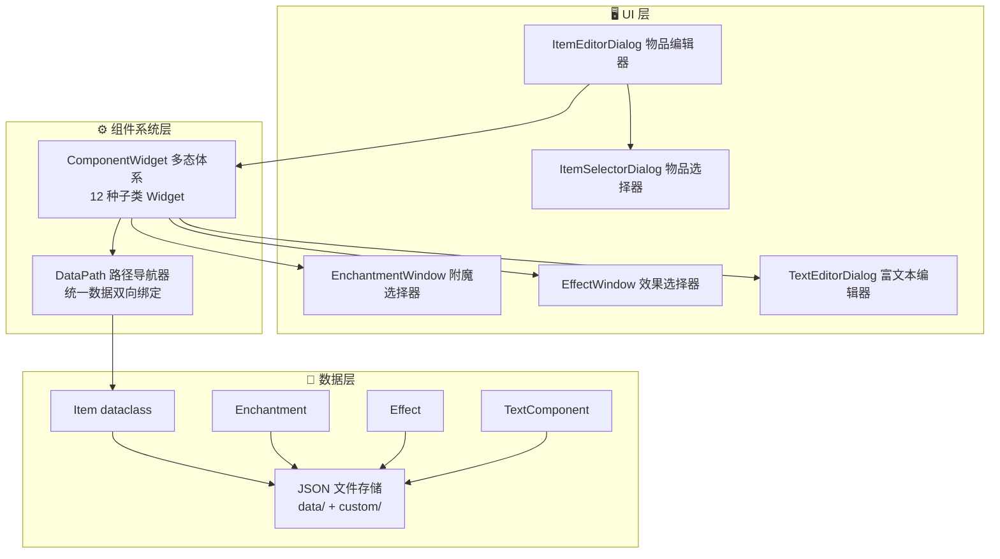
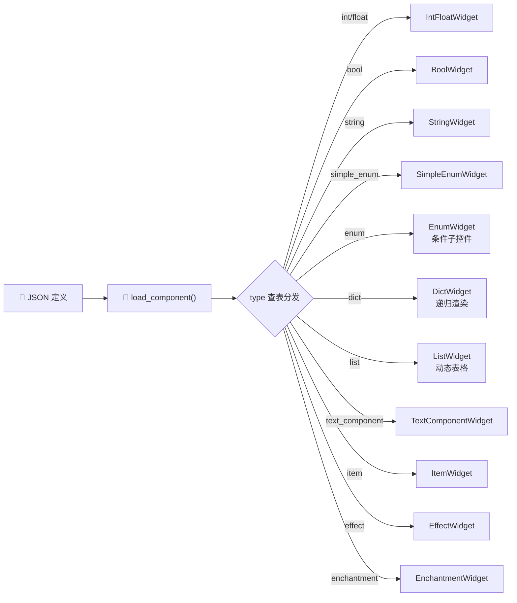
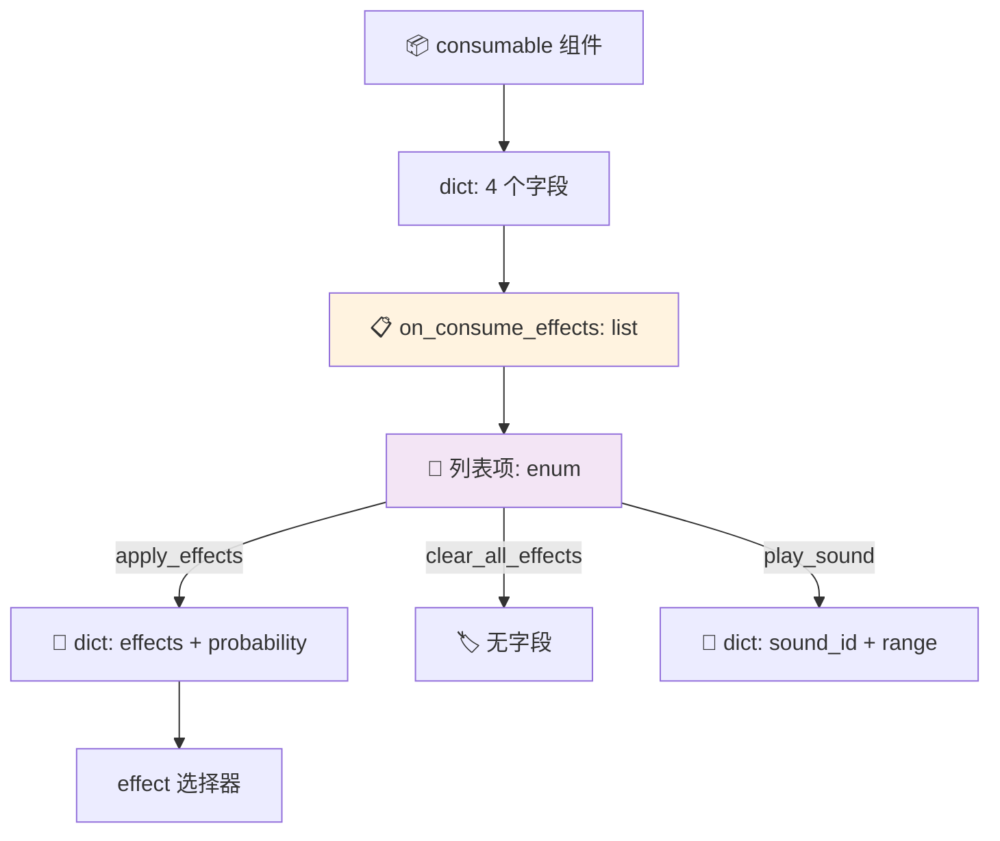
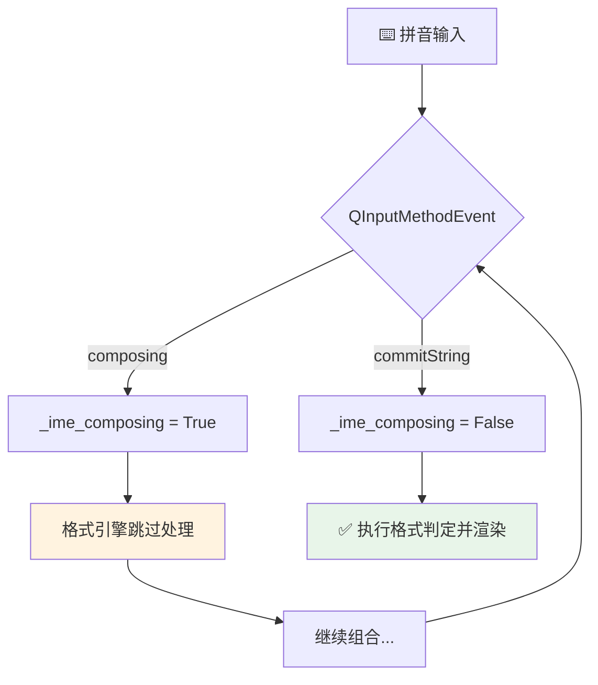
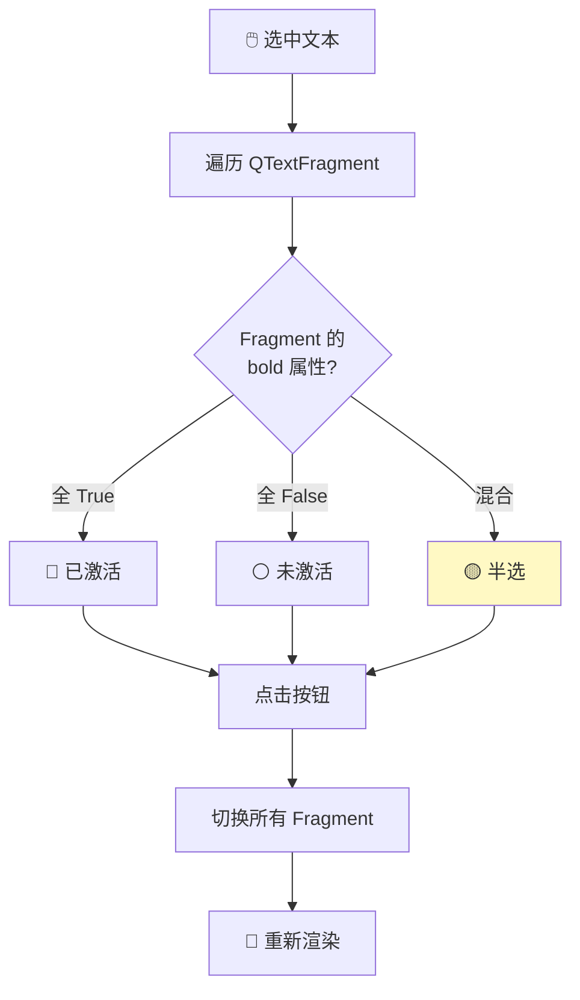
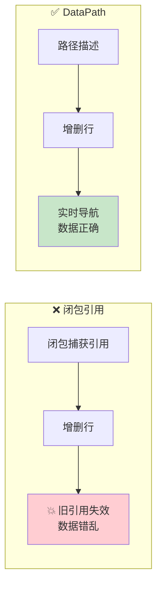

# Minecraft 物品编辑器 —— 期末项目 PPT 大纲

---

## 幻灯片 1：封面

- **标题**：Minecraft 物品编辑器 —— 基于 PyQt6 的图形化物品自定义工具
- **副标题**：Python 程序设计课程期末项目
- **作者**：（填写姓名）
- **日期**：2026 年 6 月

---

## 幻灯片 2：项目背景与动机

- **Minecraft 1.21 大更新**：物品堆叠组件系统取代 NBT 标签，物品自定义能力大幅增强
- **原版痛点**：
  - 🔍 需反复查 Wiki，知识门槛高
  - 📝 手动编写嵌套 JSON 格式极易出错
  - 🔄 缺乏即时预览，调试效率低
  - 🎨 JSON 文本组件（Raw JSON Text）结构复杂，手动编写几乎不可能
- **项目目标**：让任何玩家——无论技术水平——都能轻松创建自定义物品

---

## 幻灯片 3：项目概览

- **一句话描述**：一款 PyQt6 桌面应用，用图形界面替代手写 JSON 来编辑 Minecraft 物品
- **技术栈**：Python 3.14 + PyQt6 + JSON
- **核心理念**：数据驱动 —— 组件功能由 JSON 文件定义，GUI 自动生成
- **关键数字**：
  - 16 种物品堆叠组件
  - 40+ 属性修饰符类型
  - 30+ 状态效果 + 30+ 附魔预设
  - 10 种字段控件类型

---

## 幻灯片 4：核心功能（一）—— 物品编辑器主界面

- **多列响应式布局**：根据窗口宽度自动 1/2/3 列排布
- **四大功能区域**：
  1. 保存 / 加载 / 一键生成 `/give` 命令
  2. 基本设置：选择基础物品 + 设置数量（1–6400）
  3. 组件开关面板：FlowLayout 流式布局，按 6 大类分组
  4. 组件详情面板：动态展示已启用组件的编辑界面
- **示意图**：编辑器主界面截图（占位）

---

## 幻灯片 5：核心功能（二）—— 模块一览

- **物品选择器**：
  - 网格展示所有物品（64×64 图标 + 名称）
  - 支持 12 种分类过滤 + 文本搜索
  - 自动加载纹理 / 生成占位图标
- **附魔选择器 & 效果选择器**：
  - 双面板布局（已选 ⇄ 全部）
  - 支持保存/加载预设组
- **JSON 富文本编辑器**：
  - Word 风格 Run 级格式引擎（B/I/U/S/O 五种格式互不干扰）
  - 16 种 Minecraft 预设颜色
  - 支持点击/悬停事件编辑
  - 中文输入法（IME）安全兼容

---

## 幻灯片 6：示例展示（一）

- **「玻璃剑」—— 超高伤害 + 极低耐久**
  - 组件：`custom_name`（水蓝色）+ `lore`（红色警告）+ `max_damage=1` + `attribute_modifiers`（攻击 +9999）
  - 生成命令预览（占位）+ GUI 截图（占位）

- **「生命之泉」—— 饮用型持续恢复药水**
  - 组件：`consumable`（饮用动画/1.6s/破碎粒子）+ `on_consume_effects`（生命恢复 III × 30s）+ `custom_name`（金色）
  - 生成命令预览（占位）+ 效果选择器截图（占位）

---

## 幻灯片 7：示例展示（二）

- **「疾风靴」—— 穿戴后 +40% 移速**
  - 组件：`equippable`（靴子槽位）+ `attribute_modifiers`（移速 +0.4 / add_multiplied_base）+ `custom_name`（白色斜体）
  - 生成命令预览（占位）+ 属性列表截图（占位）

- **「收割者之镰」—— 多重附魔锄**
  - 组件：`enchantments`（锋利 V + 效率 V + 抢夺 III）+ `custom_name`
  - 生成命令预览（占位）+ 附魔选择器截图（占位）

---

## 幻灯片 8：技术架构

- **三层架构图**：

- **模块依赖**：`ItemEditorDialog` → `ItemSelectorDialog` / `EnchantmentWindow` / `EffectWindow`；`component.py` 调度所有 Widget 构建器；`DataPath` 统一双向绑定

---

## 幻灯片 9：技术挑战 ① —— JSON 到 GUI 的通用映射

- **问题**：一个 JSON 定义文件如何自动生成对应的 GUI？字段类型多达 10 种（int / float / string / bool / simple_enum / enum / dict / list / item / effect / enchantment / text_component），每种需要不同的控件和交互逻辑
- **解决方案**：**ComponentWidget 多态构建器体系**
  - 基类 `ComponentWidget` 定义 `build() → QHBoxLayout` 统一接口
  - 每种字段类型封装为独立子类（`IntFloatWidget`、`BoolWidget`、`EnumWidget`、`ListWidget` 等 12 个）
  - 顶层调度函数 `load_component()` 根据 `type` 字段查表分发
  - **效果**：新增字段类型只需新增一个子类并注册，无需修改任何调度代码
- **示意图**：

---

## 幻灯片 10：技术挑战 ② —— 嵌套数据结构的递归渲染

- **问题**：组件支持 `dict` 和 `list` 的任意深度嵌套。如 `consumable → on_consume_effects` 是列表，列表项是 `enum`，选不同枚举值后又展开不同 `dict`，其中还可能嵌套 `effect` 选择器。GUI 需要正确递归生成并绑定到深层路径
- **解决方案**：**递归 load_component + DataPath.on_dict 分离模式**
  - `DictWidget.build()` 遍历 `values` 键，对每个子字段递归调用 `load_component()`
  - `ListWidget` 维护 `list[dict]` 作为行数据容器，每行通过 `DataPath.on_dict(row_dict)` 独立绑定
  - 行增删时同步更新底层数组索引，索引重排自动处理
  - 类型不匹配时（如期望 list 却是 dict）自动发出警告并修正
- **示意图**：

---

## 幻灯片 11：技术挑战 ③ —— 中文输入法 IME 兼容性

- **问题**：QTextEdit 在 IME 组合输入（拼音→汉字）过程中，`textChanged` 信号会在组合态触发，导致格式引擎误将未完成的拼音字符当作正式文本处理。此外组合态光标与预编辑文本（preedit）的渲染可能出现异常
- **解决方案**：**SafeTextEdit 子类**
  - 子类化 QTextEdit，重写 `inputMethodEvent` 方法
  - 在处理 `QInputMethodEvent` 前后维护 `_ime_composing` 状态标记
  - 格式引擎检测到 `_ime_composing == True` 时**跳过所有格式判定与渲染**
  - 仅在 `QInputMethodEvent.commitString` 到来时（组合确认），才执行格式重新判定并渲染
  - **效果**：拼音输入过程完全不受格式引擎干扰，确认后自动获得正确格式
- **示意图**：

---

## 幻灯片 12：技术挑战 ④ —— Minecraft JSON 文本组件编辑

- **问题**：Minecraft JSON 文本组件是树状结构（`text` + `extra[]` 子节点），每个节点有独立的 bold/italic/color/clickEvent 等属性，样式可被子节点继承。如何在一个 QTextEdit 中实现与 Minecraft 规范一致的所见即所得编辑？
- **解决方案**：**Run 级格式引擎**
  - 以 `QTextFragment`（Run）为最小格式判定单元——类似 Word 的格式模型
  - 用户选中文本后，引擎遍历该范围内所有 Fragment：
    - 全部为加粗 → 加粗按钮"已激活"状态
    - 部分加粗 → 加粗按钮"不确定"（半选）状态
    - 点击按钮 → 切换全部选中 Fragment 的格式
  - 五种格式（B/I/U/S/O）独立判定，互不干扰
  - 16 种 Minecraft 预设颜色以可点击的颜色按钮面板展示
  - 导出时递归 QTextDocument Fragment 树 → 自动合并相邻同格式 Fragment 为 `extra` 子节点 → 输出最简合法 JSON
- **示意图**：

---

## 幻灯片 13：技术挑战 ⑤ —— 数据绑定的一致性问题

- **问题**：早期版本中，每个控件通过 Python 闭包（`getter/setter/clearer`）访问 `Item.components` 深层数据。当用户向列表添加新行时，新控件创建的闭包捕获了**当前字典的引用**；但列表被删除后重建时，旧闭包的引用已失效，导致数据读写错乱、增删行后数据错位
- **解决方案**：**DataPath 路径导航器**
  - **核心思想**：不缓存数据引用，每次 `read()` / `write()` / `delete()` 都从 `Item.components` 实时沿路径导航到目标节点
  - **两种模式**：
    - 组件模式：`DataPath(item, component_id, field_keys)` → `item.components[comp][k1][k2]...`
    - 分离模式：`DataPath.on_dict(root_dict)` → 直接操作独立 dict（用于列表项内部）
  - **自动纠错**：写入时自动创建缺失的中间容器，类型不匹配时发出警告并修正
  - **效果**：彻底消除闭包引用隐患，列表项增删不再导致数据错乱
- **示意图**：

---

## 幻灯片 14：总结与致谢

- **项目成果**：
  - ✅ 完整实现 16 种物品堆叠组件的图形化编辑
  - ✅ 数据驱动的可扩展架构（新增组件 = 新增 JSON）
  - ✅ 完整的附魔 / 效果 / 属性 / 文本编辑支持
  - ✅ 一键生成 `/give` 命令，即复制即用
- **技术亮点**：ComponentWidget 多态体系 · DataPath 数据绑定 · Run 级格式引擎 · IME 安全编辑
- **致谢**：感谢课程老师的指导与支持
